# Guía de entregables de diseño para el sitio público

Especificaciones de archivo, fundamentos visuales, responsive, componentes, pantallas, assets y handoff.

El objetivo de esta guía es que el diseño pueda implementarse sin tener que adivinar valores, variantes, assets ni comportamiento responsive.

> **Alcance: MVP público en modo claro. El archivo de diseño debe ser editable, inspeccionable y preparado para handoff.**

# 1. Objetivo y entregables

Definir el sistema visual y las pantallas del sitio público actual con especificaciones suficientes para reproducir el diseño en desarrollo sin inferir colores, tipografías, medidas, espaciados, comportamiento responsive ni assets.

## Entregables obligatorios

> **1.** Archivo de diseño editable, preferentemente en Figma.
>
> **2.** Fundamentos visuales con valores exactos: color, tipografía, espaciado, grid, contenedores, bordes, radios y sombras cuando se utilicen.
>
> **3.** Componentes reutilizables con variantes y estados.
>
> **4.** Pantallas finales en mobile y desktop; tablet cuando exista un cambio de layout que no pueda inferirse con claridad.
>
> **5.** Assets finales exportables: logotipo, variantes de marca utilizadas, iconografía propia y recursos gráficos necesarios.
>
> **6.** Especificación de fuentes, pesos, origen y licencia.
>
> **7.** Notas de comportamiento únicamente cuando una decisión no sea evidente en el diseño.
>
> **8.** Identificación visible del material listo para desarrollo.

> **Una colección de capturas planas no constituye un handoff suficiente: los valores visuales y los assets deben poder inspeccionarse o consultarse de forma explícita.**

# 2. Archivo de diseño

## Formato preferido

La opción preferida es un archivo Figma editable. Puede utilizarse una herramienta equivalente si permite inspeccionar valores exactos, identificar componentes y variantes, revisar responsive, exportar assets y separar con claridad diseños finales de exploraciones.

## El archivo debe permitir inspeccionar

- dimensiones y posición;

- padding y gap;

- colores;

- familia, peso, tamaño, line-height y letter-spacing;

- radios, bordes y sombras;

- componentes y variantes;

- assets configurados para exportación.

## Estructura recomendada

> **Sección** | **Contenido**                  |
|-------------|--------------------------------|
| 00          | Portada y estado de entrega    |
| 01          | Fundamentos visuales           |
| 02          | Componentes                    |
| 03          | Home                           |
| 04          | Listado de noticias            |
| 05          | Detalle de noticia             |
| 06          | Página institucional           |
| 07          | Estados y 404                  |
| 08          | Exploraciones, sólo si existen |

## Nombres semánticos

Usar nombres estables y descriptivos para secciones, frames y componentes. Mantener una única versión final claramente identificada por viewport y separar las exploraciones del material listo para desarrollo.

| **Correcto**                                 | **Evitar**  |
|----------------------------------------------|-------------|
| Fundamentos / Color                          | Frame 123   |
| Componente / Tarjeta de noticia / Principal  | Card 7      |
| Página / Home / Desktop / Final              | Final final |
| Página / Detalle de noticia / Mobile / Final | Copy 4      |

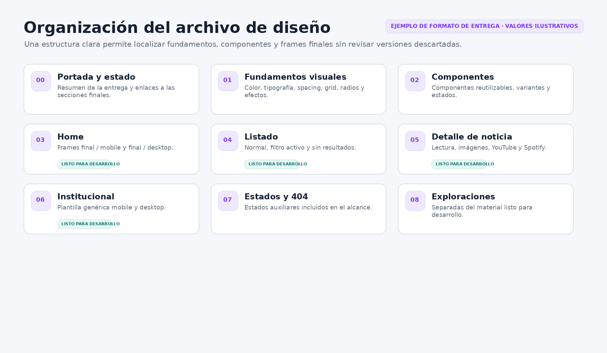

Ejemplo de organización del archivo y de separación entre material final y exploraciones.

# 3. Fundamentos visuales

Los fundamentos deben quedar definidos con nombres y valores exactos. Los ejemplos de esta sección muestran el nivel de precisión esperado; sus valores son ilustrativos.

## 3.1. Color

Entregar cada color con nombre semántico, valor exacto y función. Cuando un color cambie por interacción, documentar la relación entre sus estados.

| **Nombre**                   | **Valor**      | **Uso principal**        |
|------------------------------|----------------|--------------------------|
| Color / Brand / Primary      | \#\_\_\_\_\_\_ | Marca y acento principal |
| Color / Background / Page    | \#\_\_\_\_\_\_ | Fondo general            |
| Color / Background / Surface | \#\_\_\_\_\_\_ | Superficies              |
| Color / Text / Primary       | \#\_\_\_\_\_\_ | Texto principal          |
| Color / Text / Secondary     | \#\_\_\_\_\_\_ | Metadata                 |
| Color / Border / Default     | \#\_\_\_\_\_\_ | Bordes y divisores       |
| Color / Link / Default       | \#\_\_\_\_\_\_ | Enlaces                  |
| Color / Focus                | \#\_\_\_\_\_\_ | Indicador de foco        |

- Usar HEX para colores sólidos destinados a web.

- Indicar RGBA u opacidad cuando exista transparencia.

- Definir todos los valores y la dirección si se utiliza un gradiente.

- Documentar Default, Hover, Active y Focus cuando cambien visualmente.

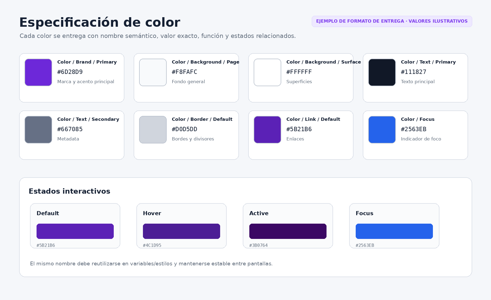

Ejemplo de especificación de paleta y estados interactivos.

## 3.2. Tipografía

Identificar cada familia tipográfica, su origen, licencia, uso, pesos, estilos y fallback. La escala debe expresar valores exactos por viewport cuando cambien.

| **Campo**          | **Especificación**                  |
|--------------------|-------------------------------------|
| Nombre exacto      |                                     |
| Proveedor u origen |                                     |
| Licencia           |                                     |
| Uso                | Títulos / lectura / interfaz / otro |
| Pesos utilizados   | Ej. 400, 500, 700                   |
| Estilos utilizados | Normal / italic                     |
| Fallback web       | Ej. "Nombre", Arial, sans-serif     |

La escala tipográfica debe cubrir como mínimo H1, H2, H3, cuerpo, texto pequeño, metadata, captions, créditos, navegación y controles que utilicen un estilo propio. Para cada estilo indicar familia, peso, tamaño, line-height y letter-spacing.

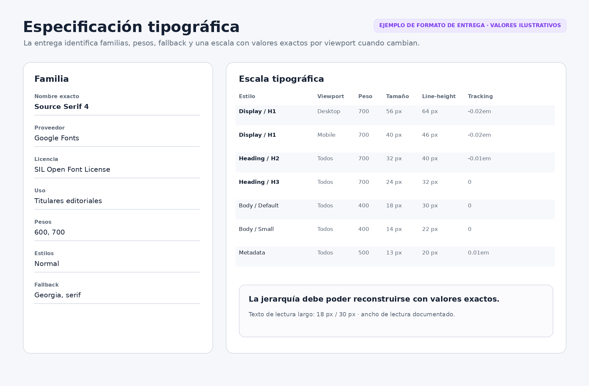

Ejemplo de ficha de familia y escala tipográfica preparada para implementación.

## 3.3. Espaciado

Definir una escala reutilizable para padding, gap, separación entre elementos relacionados, separación entre secciones y márgenes verticales del contenido editorial.

| **Nombre** | **Valor**-----------|
| Space / 1  | \_\_ px   |
| Space / 2  | \_\_ px   |
| Space / 3  | \_\_ px   |
| Space / 4  | \_\_ px   |
| Space / 5  | \_\_ px   |
| Space / 6  | \_\_ px   |

Cuando un valor excepcional no pertenezca a la escala, identificarlo en el componente o layout donde se utiliza.

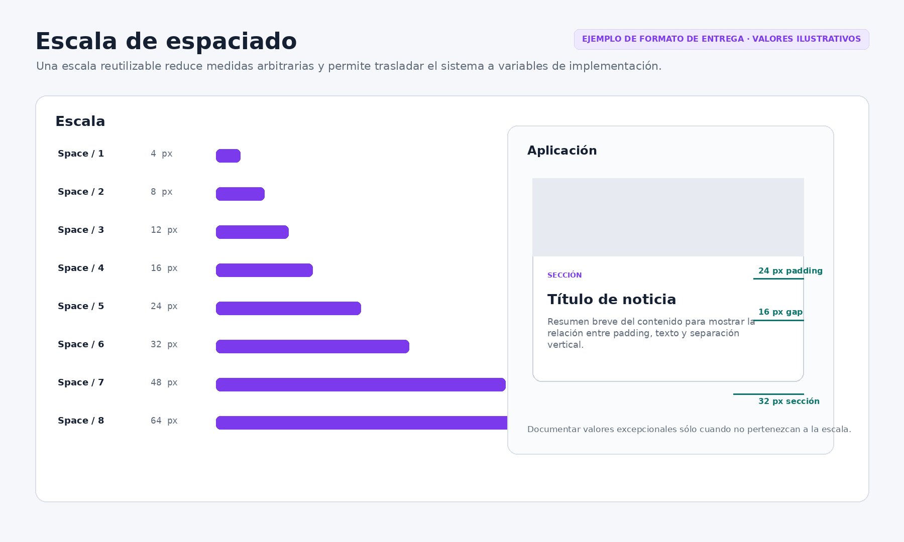

Ejemplo de escala de spacing y aplicación de valores dentro de un componente.

## 3.4. Grid, contenedores y anchos

Definir la estructura de layout por viewport y documentar por separado los anchos máximos de contenido y de lectura.

> **Viewport de referencia** | **Columnas** | **Margen lateral** | **Gutter** | **Contenedor máx.**--------------|--------------------|------------|---------------------|
| Mobile                     |              |                    |            |                     |
| Tablet, si aplica          |              |                    |            |                     |
| Desktop                    |              |                    |            |                     |

> **Medida**                              | **Valor**-----------|
| Ancho máximo del contenido general      |           |
| Ancho máximo de lectura de artículos    |           |
| Ancho máximo de contenido institucional |           |
| Ancho o comportamiento de multimedia    |           |

La implementación actual utiliza Bootstrap 5. El diseñador no necesita especificar clases técnicas, pero una grilla responsive convencional facilita la traducción del diseño. En desktop, una grilla de 12 columnas es la referencia más directa. Cualquier composición que se aparte de la grilla principal debe quedar identificada.

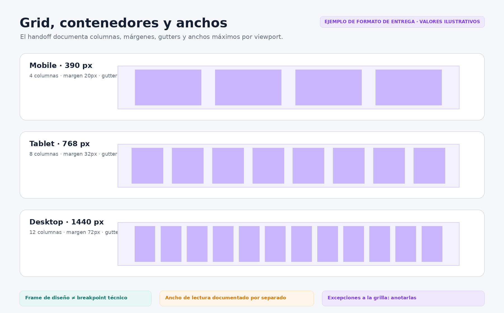

Ejemplo de especificación de columnas, márgenes, gutters y contenedor por viewport.

## 3.5. Bordes, radios y sombras

Documentar únicamente las propiedades utilizadas en el diseño final.

- Radios: nombre, valor y uso.

- Bordes: grosor, estilo y color.

- Sombras: nombre, x, y, blur, spread, color/opacidad y componentes donde se utilizan.

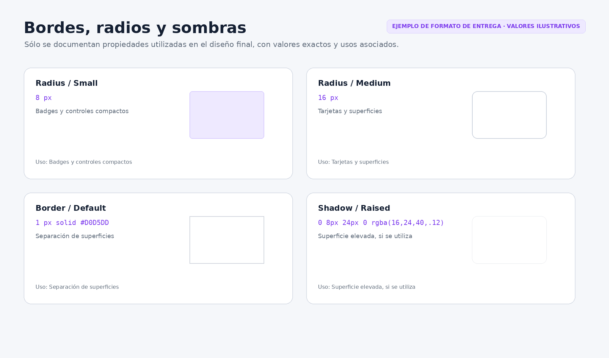

Ejemplo de especificación de radios, bordes y efectos de superficie.

## 3.6. Marca, logotipo e iconografía

### Nombre del sitio

El diseño debe mostrar el nombre de marca utilizado y su relación con el logotipo. Si el nombre público todavía no está aprobado, marcarlo como provisional y evitar integrarlo de forma irreversible dentro de un asset raster.

### Logotipo

Entregar únicamente las variantes realmente utilizadas. Para cada variante indicar nombre, uso, fondo previsto, formato final, área de seguridad y tamaño mínimo cuando aplique. El formato preferido para logotipos vectoriales es SVG con fondo transparente y viewBox correcto.

### Iconografía

Si se utiliza una librería existente, identificar nombre, origen y licencia. Si se crean iconos propios, entregar cada icono final en SVG y mantener un sistema consistente de tamaño y trazo.

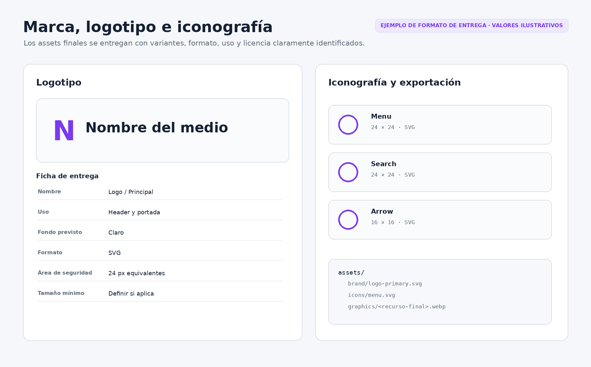

Ejemplo de ficha de logo, iconografía y estructura de exportación de assets.

# 4. Responsive

## Viewports de diseño

> **Viewport** | **Entregable**                                                                                      |
|--------------|-----------------------------------------------------------------------------------------------------|
| Mobile       | Frame final representativo entre 360 y 430 px.                                                      |
| Desktop      | Frame final representativo entre 1200 y 1440 px.                                                    |
| Tablet       | Alrededor de 768 px cuando exista un cambio material que no pueda inferirse entre mobile y desktop. |

Se recomienda mantener un ancho de referencia consistente para todas las páginas de una misma familia, por ejemplo 390 px, 768 px y 1440 px. Estos tamaños son frames de diseño, no los únicos anchos que tendrá el sitio real.

## Cambios que deben quedar definidos

- número de columnas;

- orden y alineación de elementos;

- ancho relativo de bloques;

- comportamiento y proporción de imágenes;

- cambios tipográficos;

- cambios de padding o gap;

- componentes que pasan de horizontal a vertical;

- comportamiento del menú;

- elementos que se ocultan, únicamente si aplica.

Cuando el cambio sea evidente en los frames finales no es necesario repetirlo en una nota. Anotar sólo el comportamiento que no pueda inferirse visualmente.

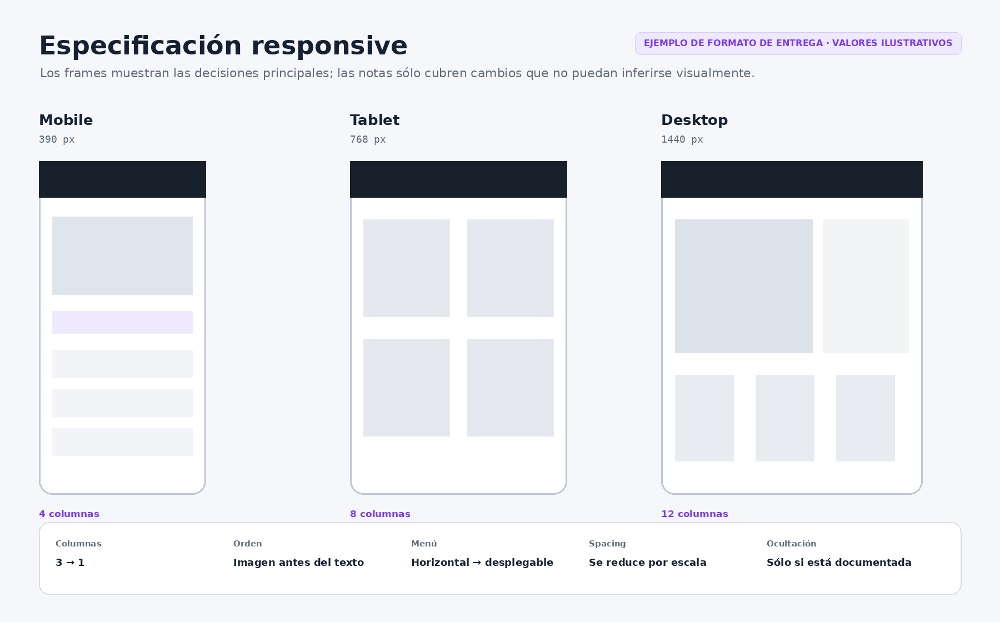

Ejemplo de entrega responsive con frames de referencia y reglas de cambio entre tamaños.

# 5. Componentes

Cada componente reutilizable debe quedar definido mediante sus variantes y estados. No es necesario crear una ficha textual independiente cuando la información pueda inspeccionarse claramente en el componente y sus propiedades.

| **Campo**          | **Contenido**                                  |
|--------------------|------------------------------------------------|
| Nombre             | Nombre semántico                               |
| Anatomía           | Partes que lo componen                         |
| Variantes          | Diferencias estructurales reales               |
| Estados            | Default, hover, focus, active, etc.            |
| Tamaño             | Fijo, fluido o condicionado por contenedor     |
| Responsive         | Cambios entre viewports                        |
| Contenido variable | Qué elementos pueden crecer, faltar o envolver |
| Assets             | Iconos o imágenes asociados                    |

## Componentes mínimos

| **Grupo**           | **Componentes**                                                                                                                                             |
|---------------------|-------------------------------------------------------------------------------------------------------------------------------------------------------------|
| Navegación          | Header, navegación desktop, menú mobile, enlace activo si se utiliza, identidad de marca y footer.                                                          |
| Noticias            | Tarjeta principal, tarjeta secundaria, tarjeta/item de listado, variantes con y sin imagen, badge de sección, fecha, créditos y resumen cuando corresponda. |
| Contenido editorial | Cabecera de artículo, imagen destacada, cuerpo de lectura, H2, H3, enlaces, figura, caption, crédito, YouTube y Spotify.                                    |
| Interacción         | Botón primario, botón secundario si se usa, enlace textual, hover, focus y active cuando corresponda.                                                       |
| Estados             | Estado vacío general y filtro sin resultados.                                                                                                               |
| Institucional       | Patrón de página institucional genérica.                                                                                                                    |

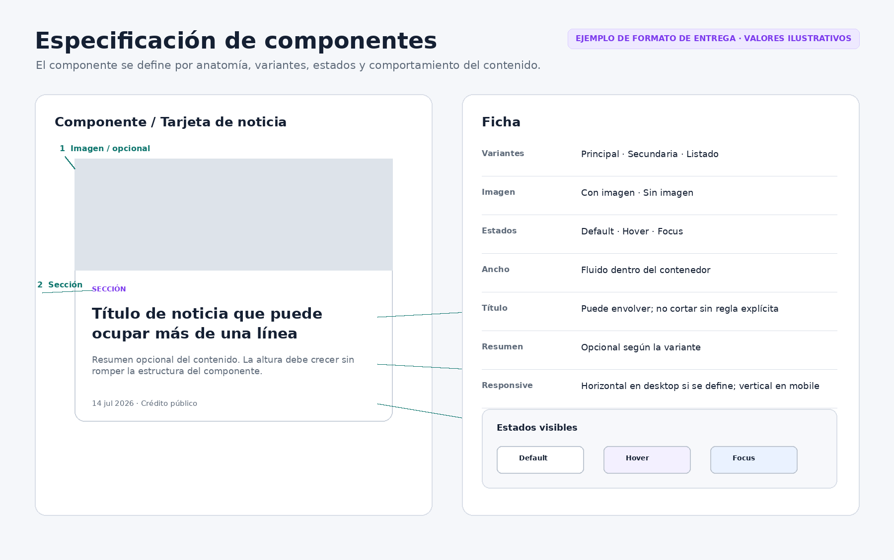

Ejemplo de anatomía, variantes, estados y comportamiento de contenido en un componente reutilizable.

# 6. Pantallas finales

Cada superficie debe entregarse como frame final en mobile y desktop. Tablet se incluye sólo cuando aporta una decisión adicional de layout.

## 6.1. Home

- noticia principal;

- noticias secundarias;

- navegación y footer;

- componentes de noticia utilizados;

- variantes con y sin imagen cuando correspondan.

## 6.2. Listado de noticias

- estado normal;

- filtro por sección activo;

- estado sin resultados;

- mobile y desktop.

## 6.3. Detalle de noticia

- cabecera editorial y metadata;

- imagen destacada cuando exista;

- cuerpo de lectura;

- H1, H2 y H3;

- imágenes del cuerpo, caption y crédito;

- YouTube y Spotify;

- enlaces y etiquetas cuando estén presentes.

Debe quedar definido el ancho de lectura, la separación vertical del contenido, la jerarquía tipográfica y el tratamiento de imágenes y multimedia.

## 6.4. Página institucional genérica

- título;

- introducción cuando exista;

- cuerpo;

- subtítulos;

- enlaces;

- mobile y desktop.

## 6.5. Navegación, footer y estados

- header desktop;

- menú mobile cerrado y abierto;

- footer;

- estado vacío;

- filtro sin resultados;

- página 404, opcional.

| **Las interacciones o composiciones especialmente personalizadas deben marcarse como “Requiere validación técnica” antes de considerarse comprometidas para implementación.**

# 7. Assets y handoff

## Paquete de assets finales

Todo recurso necesario para reproducir el diseño debe estar identificado, marcado como final, exportable y separado de los recursos utilizados únicamente para mockups.

> **Tipo**                                                  | **Formato preferido**-----------------------|
| Logotipos, iconos e ilustraciones vectoriales             | SVG                   |
| Raster final optimizado para web                          | WebP                  |
| Raster con transparencia o necesidad específica           | PNG                   |
| Fotografía cuando sea apropiado                           | JPEG o WebP           |
| Fuente alojada por el proyecto, si la licencia lo permite | WOFF2                 |

## Fuentes

Indicar nombre exacto, pesos y estilos utilizados, proveedor, licencia y método previsto de uso. No entregar pesos que el diseño no utiliza. No incorporar una fuente comercial sin informar al equipo de su licencia.

## Estados del diseño

| **Estado**                  | **Significado**                                                                 |
|-----------------------------|---------------------------------------------------------------------------------|
| Listo para desarrollo       | Diseño final aprobado para implementación.                                      |
| En exploración              | Alternativa o trabajo todavía no cerrado.                                       |
| Propuesta futura            | Idea que no pertenece al alcance actual.                                        |
| Requiere validación técnica | Diseño o interacción que debe revisarse antes de comprometer su implementación. |

## Notas de handoff

Añadir notas sólo cuando el diseño no comunique por sí mismo una decisión relevante, por ejemplo:

- comportamiento responsive no evidente;

- regla de recorte de una imagen;

- elemento que cambia de posición;

- variante excepcional;

- interacción;

- asset externo;

- comportamiento de texto variable;

- excepción a la grilla.

## Entrega final

> **1.** Enlace al archivo editable.
>
> **2.** Enlaces directos a las secciones o frames finales cuando la herramienta lo permita.
>
> **3.** Assets finales.
>
> **4.** Información de fuentes y licencias.
>
> **5.** Identificación del material listo para desarrollo.
>
> **6.** Lista breve de decisiones todavía abiertas, si existen.

# 8. Contexto del sitio actual

El diseño se aplica a las superficies públicas existentes. Las capturas siguientes sirven para identificar el contenido y las superficies que deben rediseñarse.

## Superficies existentes

> **1.** Home.
>
> **2.** Listado de noticias en /noticias/.
>
> **3.** Filtro del listado por sección.
>
> **4.** Detalle de noticia.
>
> **5.** Página institucional genérica.
>
> **6.** Header y navegación.
>
> **7.** Footer.
>
> **8.** Estados vacíos.
>
> **9.** Página 404, opcional dentro de este encargo.

Las secciones editoriales funcionan como navegación y filtro; no son páginas independientes.

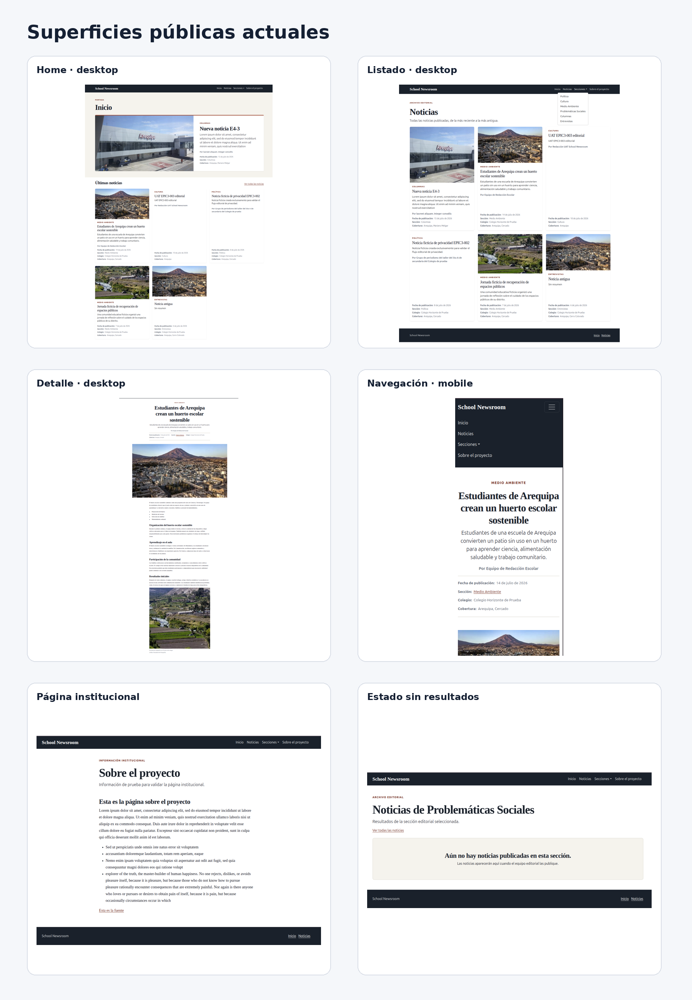

Referencia de las superficies públicas actuales.

## Contenido que los componentes deben soportar

- noticia con y sin imagen;

- título corto y largo;

- uno o varios créditos públicos;

- detalle con y sin imagen destacada;

- artículo largo;

- imagen de cuerpo con caption y crédito;

- bloque YouTube;

- bloque Spotify.

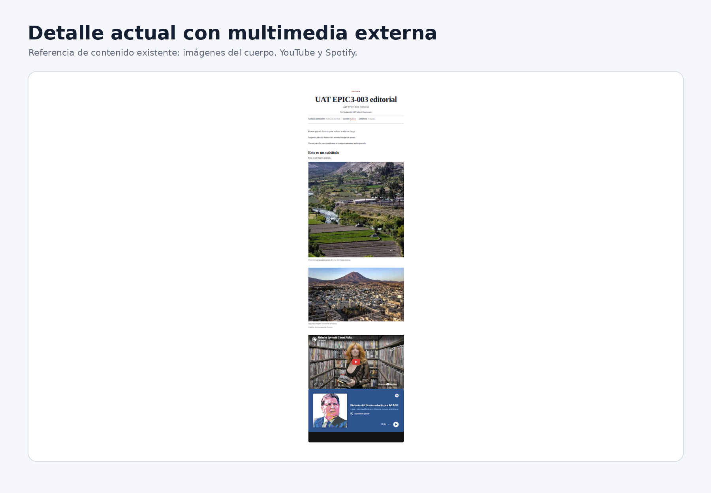

Referencia del detalle actual con imágenes del cuerpo, YouTube y Spotify.

## Límites del encargo

No forman parte del diseño comprometido para este encargo:

- formulario de contacto;

- compartir en redes;

- nueva paginación;

- búsqueda avanzada;

- sistema de talleres;

- newsletter;

- dashboard;

- app móvil;

- Wagtail Admin;

- dark mode;

- frontend separado.

Si alguna de estas ideas aparece como exploración, debe permanecer fuera de las pantallas marcadas como “Listas para desarrollo”.

# 9. Checklist final de entrega

## Archivo y estructura

☐ Archivo editable compartido.

☐ Secciones y frames con nombres semánticos.

☐ Una versión final identificable por viewport.

☐ Exploraciones separadas del material final.

☐ Frames finales marcados como Listo para desarrollo.

## Fundamentos visuales

☐ Colores con nombre, valor exacto y uso.

☐ Estados interactivos de color definidos cuando aplican.

☐ Familias tipográficas, pesos, estilos, origen y licencia identificados.

☐ Escala tipográfica con tamaño, line-height y letter-spacing cuando corresponda.

☐ Escala de espaciado definida.

☐ Grid, gutters y márgenes laterales por viewport definidos.

☐ Ancho máximo de contenedor y ancho máximo de lectura definidos.

☐ Radios, bordes y sombras definidos si se usan.

## Marca y assets

☐ Nombre de marca utilizado identificado.

☐ Logotipo final exportable.

☐ Variantes de logotipo utilizadas identificadas.

☐ Iconografía propia exportable.

☐ Librerías de iconos y licencias identificadas si se usan.

☐ Assets raster finales identificados.

☐ Assets de mockup separados de assets de interfaz.

☐ Fuentes y licencias identificadas.

## Componentes

☐ Header y navegación desktop.

☐ Menú mobile.

☐ Footer.

☐ Tarjeta principal.

☐ Tarjeta secundaria.

☐ Item o tarjeta de listado.

☐ Variantes con y sin imagen.

☐ Badge de sección y metadata.

☐ Cabecera de artículo.

☐ Figura con caption y crédito.

☐ YouTube y Spotify.

☐ Botones y enlaces utilizados.

☐ Hover y focus.

☐ Estado vacío y filtro sin resultados.

☐ Patrón institucional.

## Pantallas y responsive

☐ Home mobile y desktop.

☐ Listado mobile y desktop.

☐ Filtro activo.

☐ Estado sin resultados.

☐ Detalle mobile y desktop.

☐ Página institucional mobile y desktop.

☐ Menú mobile abierto.

☐ Tablet donde exista una decisión material adicional.

☐ Cambios responsive no evidentes anotados.

## Handoff

☐ Assets configurados para exportación o entregados.

☐ Enlaces directos a frames finales disponibles.

☐ Notas añadidas sólo donde son necesarias.

☐ Decisiones abiertas registradas.

☐ Propuestas futuras separadas.

☐ Elementos que requieren validación técnica identificados.
